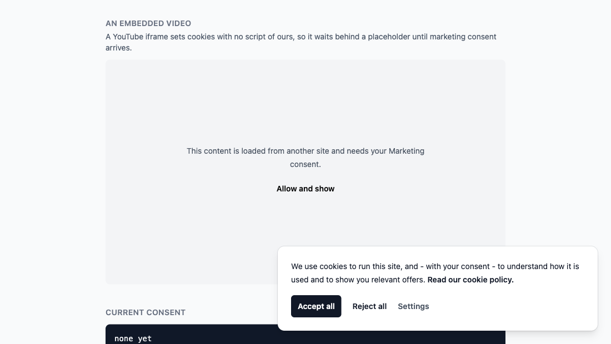
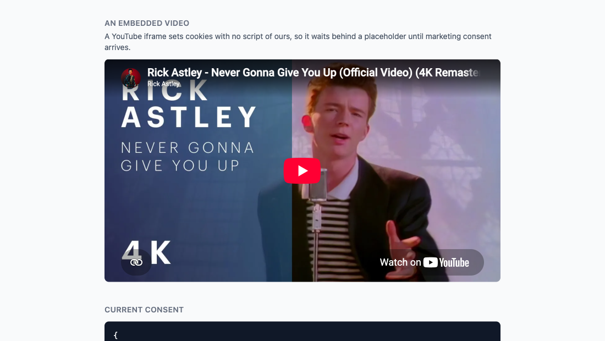

# Consently

[](https://rubygems.org/gems/consently)
[](https://rubygems.org/gems/consently)
[](https://github.com/Xeross99/consently/actions/workflows/ci.yml)
[](MIT-LICENSE)

**GDPR cookie consent for Rails that actually blocks your tags.**

Most banners ask for consent and load Google Analytics anyway. Consently is
the other half. Declare your tags once; every non-essential one is rendered as
an inert `<script type="text/plain">` the browser will not even fetch, and
becomes a live script the instant the visitor agrees - no page reload, no lost
pageview.

**[Try it in your browser](https://xeross99.github.io/consently/)** - four tags
blocked on a live page, and what happens to them the moment you click.

| | |
| --- | --- |
| **Blocks** | GA4, Google Tag Manager, Google Ads, Microsoft Clarity, Meta Pixel, Hotjar, Plausible, anything custom |
| **Google Consent Mode v2** | denied by default before any Google tag, updated on the click |
| **Banner** | plain CSS, no Tailwind, no build step, ten languages |
| **Embeds** | YouTube, Vimeo and Google Maps iframes wait behind a placeholder too |
| **Ecommerce** | GA4 `purchase`, `add_to_cart` and friends, built from your own line items |
| **Cookie policy** | generated from the same config - every vendor, every cookie, every duration |
| **Multi-tenant** | different tags per domain or shop from one initializer |
| **Proof of consent** | optional log in your own database; no third-party service, nothing leaves your servers |
| **Install** | one initializer, three helpers in your layout |

Before the click, and right after it - same page, no reload in between:

| Blocked | Running |
| --- | --- |
|  |  |

The preferences panel, one category at a time:


```ruby
# config/initializers/consently.rb
Consently.configure do |c|
  c.tag :google_tag_manager, id: "GTM-XXXXXXX"
  c.tag :google_analytics,   id: "G-XXXXXXXXXX"
  c.tag :clarity,            id: "abcd1234"
  c.tag :meta_pixel,         id: "123456789012345"
end
```

```erb
<head>
  <%= consently_tags %>
</head>
<body>
  <%= consently_noscript_tags %>
  ...
  <%= consently_banner %>
</body>
```

That is the whole integration.

## Install

```ruby
gem "consently"
```

```bash
bundle install
rails g consently:install
```

On RubyGems: <https://rubygems.org/gems/consently>

The generator writes the initializer and registers the two Stimulus controllers
in `app/javascript/controllers/index.js`. Nothing else to set up: the banner
brings its own plain CSS, so there is no Tailwind, no build step and no config
file to keep in sync.

## What is a tag

| Provider | Key | Default category |
| --- | --- | --- |
| Google Tag Manager | `:google_tag_manager` | `analytics` |
| Google Analytics 4 | `:google_analytics` | `analytics` |
| Google Ads | `:google_ads` | `marketing` |
| Microsoft Clarity | `:clarity` | `analytics` |
| Meta Pixel | `:meta_pixel` | `marketing` |
| Hotjar | `:hotjar` | `analytics` |
| Plausible | `:plausible` | `analytics` (move to `necessary` if you run it without a banner) |
| anything else | `:custom` | `marketing` |

Every tag takes `category:` to move it, and `:custom` covers vendors Consently
does not know yet:

```ruby
c.tag :custom, as: :piwik, category: :analytics, src: "https://cdn.example.com/piwik.js"
c.tag :custom, as: :inline_thing, category: :marketing, inline: "console.log('hi')"
```

## Consent

Three categories out of the box - `necessary`, `analytics`, `marketing` - and
you can add your own:

```ruby
c.category :personalization
```

`necessary` never waits for a click. Everything else is blocked until the
visitor agrees, and the choice is kept in a `consently` cookie for six months.

Change your policy? Bump `c.consent_version` and every older consent stops
counting; the banner asks again. To ask again on a schedule as well - the
guidance across the EU converges on about a year - set an age:

```ruby
c.consent_max_age = 12.months
```

Spanning subdomains? Say so, or a consent given on `www` will not count on
`shop`:

```ruby
c.cookie_domain = ".example.com"
```

## Per-domain, per-tenant

One initializer, different tags per host or shop:

```ruby
c.scope_resolver = -> (request) { request.host }

c.scope "shop.example.com" do |s|
  s.tag :google_analytics, id: "G-SHOP00001"
end

c.scope "blog.example.com" do |s|
  s.tag :google_analytics, id: "G-BLOG00001"
end
```

Scopes inherit the tags declared outside them and override by declaring the
same provider again. The resolver can return anything - `Current.shop&.name`
works just as well as a host.

## The cookie policy writes itself

```erb
<h1>Cookie policy</h1>
<p>Your own legal text.</p>

<%= consently_policy %>
```

Every category, the vendors in it, the cookies each one sets and how long they
last - rendered from the configuration your tags come from, so it cannot drift
out of date. Add a tag to the initializer and it appears here, in the right
category, with its cookies.


## Proof of consent

```bash
rails g consently:consent_log
rails db:migrate
```

```ruby
# config/routes.rb
mount Consently::Engine => "/consently"

# config/initializers/consently.rb
c.log_consents = true
```

Each decision is then stored as a `Consently::ConsentRecord`: the categories,
the policy version, the scope, the user agent, and a salted digest of the IP -
enough to show a decision was made, not enough to identify anyone.

The cookie is still what decides which tags run; the table is only the proof,
since a visitor can clear their cookies and a log that lives in their browser
proves nothing. Nobody is named unless you say who they are:

```ruby
c.consent_subject = -> (request) { request.env["warden"]&.user&.id }
```

## After a choice

Nothing reloads: the tags the visitor just agreed to start running in place,
and the page keeps its scroll position and its state. If your page renders
something the server decides from consent - an embedded map, a video, a
status panel - ask for a reload instead:

```ruby
c.reload_after_choice = true
```

Either way the events waiting on that consent go out too (see below), and a
`consently:change` event fires on `document`, carrying the granted categories,
so you can react to it yourself:

```js
document.addEventListener("consently:change", ({ detail }) => {
  console.log(detail.categories) // ["analytics"]
})
```

## Who gets asked

Everyone, by default. If your legal advice says visitors outside the EU do not
need asking, say who does:

```ruby
c.consent_required = -> (request) { EU_COUNTRIES.include?(request.headers["CF-IPCountry"]) }
```

For anyone that returns false there is no banner, and every category counts as
granted.

Opt-out signals are answers, so those visitors are never asked either. Global
Privacy Control - binding in California and Colorado - is honoured out of the
box. Do Not Track is advisory, so it is opt-in:

```ruby
c.respect_do_not_track = true
```

## Accessibility

The card is a non-modal `role="dialog"` labelled by its own text, the settings
button carries `aria-expanded` and `aria-controls`, reopening the panel moves
focus into it, and the animation gives way to `prefers-reduced-motion`. Nobody
is trapped in a focus cycle they did not ask for.

## Events

GA4 wants a particular shape, and your models are not it. Hand the helper
whatever you have:

```erb
<%= consently_ecommerce "purchase", items: @order.line_items,
      value: @order.total, currency: "EUR", transaction_id: @order.number %>
```

Items may be hashes already in GA4 shape, or any object answering to
`sku`/`id`, `name`, `price`, `quantity`, `category`, `brand`, `variant` - a
line item or a product usually does. Anything else:

```erb
<%= consently_event "newsletter_signup", source: "footer" %>
```

**Sent the way your tags listen.** A page running gtag.js gets
`gtag('event', ...)` calls; a page running Google Tag Manager gets `dataLayer`
pushes, the previous `ecommerce` object cleared first as Google asks. The gem
decides per request from the tags in scope - a container means the dataLayer,
any other Google tag means gtag - because a push meant for a container is
something gtag.js silently ignores, and a whole checkout funnel can go missing
that way. Force it if you must:

```ruby
c.event_transport = :data_layer   # or :gtag; :auto is the default
```

**Held back, not dropped.** Without consent an event is rendered the way a tag
is - an inert `<script type="text/plain">` - and released together with the
tags the moment its category is granted. The product page a visitor accepts
on still counts its `view_item`.

**From a Turbo Stream.** An add-to-cart that answers with a stream renders no
page to put a script on. The stream carries the event instead, and the
JavaScript side sends it at once if the category is granted, or keeps it until
it is:

```erb
<%# line_items/create.turbo_stream.erb %>
<%= turbo_stream.replace "cart", partial: "cart" %>
<%= consently_stream_event "add_to_cart", items: [@line_item],
      currency: "EUR", value: @line_item.price %>
```

Nothing to register: the action arrives with the banner controller.

**From your own JavaScript.** The same queue, the same rule:

```js
Consently.track("newsletter_signup", { source: "footer" })
Consently.track("lead", { value: 1 }, { category: "marketing", ecommerce: false })
Consently.granted("analytics") // true or false, right now
```

## Embedded videos and maps

Blocking scripts is half the job: a YouTube iframe sets cookies on its own.

```erb
<%= consently_embed :youtube, "dQw4w9WgXcQ" %>
<%= consently_embed :vimeo, "76979871", category: :analytics %>
<%= consently_embed :google_maps, "Bahnhofstrasse 12, Berlin" %>
<%= consently_embed :custom, "https://example.com/widget", title: "Widget", ratio: "4 / 3" %>
```

Until the category is granted the visitor gets a placeholder the same size as
the embed - so nothing jumps - with a button that opens the preferences panel.
The iframe appears the moment they agree, without a reload.

| Waiting for consent | After the click |
| --- | --- |
|  |  |

What the page holds until then is only the address:

```html
<div class="consently-embed"
     data-controller="consently-embed"
     data-consently-embed-category-value="marketing"
     data-consently-embed-src-value="https://www.youtube-nocookie.com/embed/dQw4w9WgXcQ">
```

No iframe, no request to YouTube, no cookie - and `youtube-nocookie.com` is
what gets embedded once there is consent. `ratio:` sets the box (`16 / 9` by
default), `category:` decides which consent releases it, and any other option
is passed straight to the iframe:

```erb
<%= consently_embed :youtube, "dQw4w9WgXcQ", ratio: "21 / 9", allow: "autoplay; picture-in-picture" %>
```

Your own markup can do the same thing without the helper: anything carrying
`data-consently-open` opens the preferences panel, and the `consently:change`
event tells you what was granted.

## Google consent mode: basic or advanced

```ruby
c.google_consent_mode = :basic    # default
c.google_consent_mode = :advanced
```

**Basic** keeps Google's tags off the page until consent: nothing about the
visitor reaches Google before they agree.

**Advanced** loads them right away with everything denied, so they send
cookieless pings and Google Ads can model the conversions of visitors who said
no. More data for you, a request to Google either way. Which one is defensible
is a legal call, not a technical one - the gem simply does what you set.

Either way the defaults are emitted before any Google tag and updated the
moment the visitor chooses.

## Styling

The banner ships as plain CSS, driven by custom properties. Most restyling is a
few variables in your own stylesheet:

```css
:root {
  --consently-accent: #4f46e5;
  --consently-accent-text: #ffffff;
  --consently-radius: 0;
  --consently-max-width: 28rem;
}
```

The defaults live on `:root`, not on `.consently`: a blocked embed sits
somewhere else on the page and its button wears the same classes, so variables
scoped to the banner would never reach it. Scope them tighter if you mean to,
`.consently` included - it is your stylesheet.

Want the markup instead? Take the partial over, and turn the gem's stylesheet
off so it stops loading:

```bash
rails g consently:views
```

```ruby
c.stylesheet = false
```

Translations live under the `consently.*` keys; your own locale files win over
the gem's, so overriding one string means writing that one key.

## Turbo

The banner is `data-turbo-permanent`, so it survives Turbo Drive navigation
and morphed refreshes. Tags blocked at first render stay blocked across
visits until consent is given, and are rendered live from the server on the
next request after that.

## Try it

```bash
bin/rails server
```

http://localhost:3000 runs the dummy application: four tags configured, a live
list of what is blocked and what is running, the cookie as it stands, the
logged decisions and every translation to click through.

## Cheat sheet

Helpers:

| | |
| --- | --- |
| `consently_tags` | `<head>`: the stylesheet, consent mode defaults, every tag (blocked or live), and what the JavaScript side needs to know |
| `consently_noscript_tags` | after `<body>`: GTM and Meta fallbacks, for granted categories only |
| `consently_banner` | the banner, the panel, and the JavaScript that releases blocked tags |
| `consently_policy` | the generated cookie policy: categories, vendors, cookies, durations |
| `consently_preferences_link` | "Cookie settings" link; anything with `data-consently-open` reopens the panel |
| `consently_ecommerce(event, items:, **params)` | a GA4 ecommerce event, items mapped from your own objects; held back until consent |
| `consently_event(event, **payload)` | any other event, gtag or dataLayer as the page's tags expect; held back until consent |
| `consently_stream_event(event, items:, **payload)` | the same from a Turbo Stream response, sent or queued in the browser |
| `consently_embed(kind, id, category:, ratio:)` | a video or map that waits for consent |
| `consently_consent` | the current `Consently::Consent`; `granted?(:analytics)` in your own views |

Configuration:

| | |
| --- | --- |
| `c.tag key, **options` | `id:`, `domain:`, `category:`, `as:` (name it, for two of a kind) |
| `c.scope(name) { \|s\| ... }` | tags for one tenant; `c.scope_resolver` decides which one a request is |
| `c.category :name` | a category of your own beside `necessary`, `analytics`, `marketing` |
| `c.consent_version` | bump it and every older consent stops counting |
| `c.enabled` | `true`, `false`, or a callable taking the request |
| `c.reload_after_choice` | reload once a choice is made; off by default |
| `c.google_consent_mode` | `:basic` (default), `:advanced`, or `false` |
| `c.event_transport` | `:auto` (default: gtag under gtag.js, the dataLayer under a container), `:gtag`, `:data_layer` |
| `c.log_consents`, `c.consent_subject` | store proof of each decision, optionally naming who |
| `c.stylesheet` | link the banner's CSS; off if you style it yourself |
| `c.cookie_name`, `c.cookie_max_age`, `c.cookie_path`, `c.cookie_domain` | where the choice is kept |
| `c.consent_max_age` | ask again after this long, whatever the cookie says |
| `c.respect_do_not_track`, `c.respect_global_privacy_control` | treat an opt-out signal as a rejection |
| `c.consent_required` | who has to be asked at all; false means no banner and everything granted |

JavaScript: `Consently.track(event, payload, { category })` sends or queues
an event, `Consently.granted(category)` says where things stand, and a
`consently:change` event fires on `document` with the granted categories.

## Licence

MIT.
