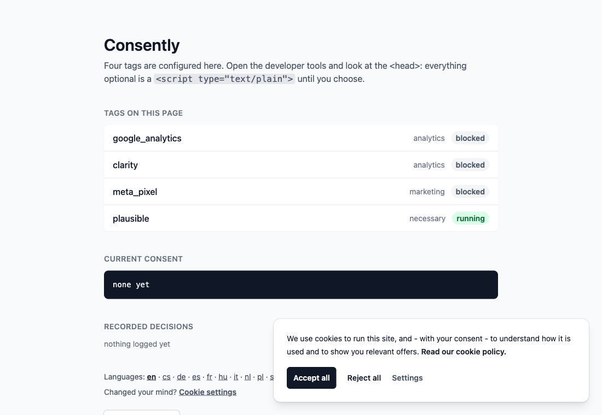
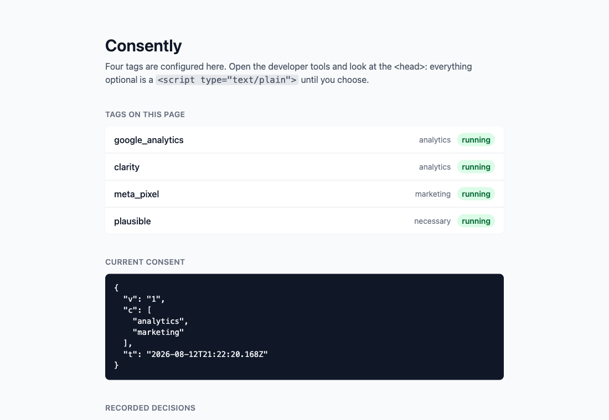
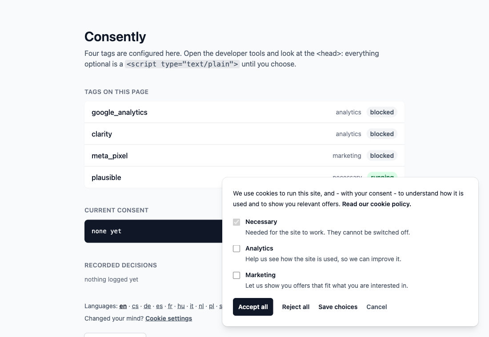
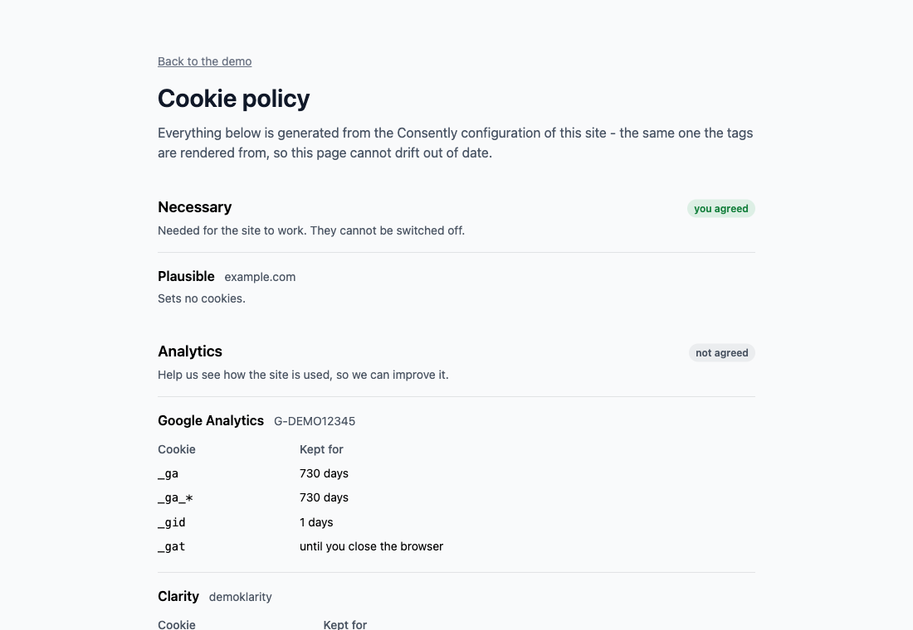

# Consently

**GDPR cookie consent for Rails that actually blocks your tags.**

Most banners ask for consent and load Google Analytics anyway. Consently is
the other half. Declare your tags once; every non-essential one is rendered as
an inert `<script type="text/plain">` the browser will not even fetch, and
becomes a live script the instant the visitor agrees - no page reload, no lost
pageview.

| | |
| --- | --- |
| **Blocks** | GA4, Google Tag Manager, Google Ads, Microsoft Clarity, Meta Pixel, Hotjar, Plausible, anything custom |
| **Google Consent Mode v2** | denied by default before any Google tag, updated on the click |
| **Banner** | plain CSS, no Tailwind, no build step, one Stimulus controller, ten languages |
| **Cookie policy** | generated from the same config - every vendor, every cookie, every duration |
| **Multi-tenant** | different tags per domain or shop from one initializer |
| **Proof of consent** | optional log in your own database; no third-party service, nothing leaves your servers |
| **Install** | one initializer, three helpers in your layout |

Before the click, and right after it - same page, no reload in between:

| Blocked | Running |
| --- | --- |
|  |  |

The preferences panel, one category at a time:



```ruby
# config/initializers/consently.rb
Consently.configure do |c|
  c.tag :google_tag_manager, id: "GTM-XXXXXXX"
  c.tag :google_analytics,   id: "G-XXXXXXXXXX"
  c.tag :clarity,            id: "abcd1234"
  c.tag :meta_pixel,         id: "123456789012345"
end
```

```erb
<head>
  <%= consently_tags %>
</head>
<body>
  <%= consently_noscript_tags %>
  ...
  <%= consently_banner %>
</body>
```

That is the whole integration.

## Install

```ruby
gem "consently"
```

```bash
bundle install
rails g consently:install
```

The generator writes the initializer and registers the Stimulus controller in
`app/javascript/controllers/index.js`. Nothing else to set up: the banner
brings its own plain CSS, so there is no Tailwind, no build step and no
config file to keep in sync.

## What is a tag

| Provider | Key | Default category |
| --- | --- | --- |
| Google Tag Manager | `:google_tag_manager` | `analytics` |
| Google Analytics 4 | `:google_analytics` | `analytics` |
| Google Ads | `:google_ads` | `marketing` |
| Microsoft Clarity | `:clarity` | `analytics` |
| Meta Pixel | `:meta_pixel` | `marketing` |
| Hotjar | `:hotjar` | `analytics` |
| Plausible | `:plausible` | `analytics` (move to `necessary` if you run it without a banner) |
| anything else | `:custom` | `marketing` |

Every tag takes `category:` to move it, and `:custom` covers vendors Consently
does not know yet:

```ruby
c.tag :custom, as: :piwik, category: :analytics, src: "https://cdn.example.com/piwik.js"
c.tag :custom, as: :inline_thing, category: :marketing, inline: "console.log('hi')"
```

## Consent

Three categories out of the box - `necessary`, `analytics`, `marketing` - and
you can add your own:

```ruby
c.category :personalization
```

`necessary` never waits for a click. Everything else is blocked until the
visitor agrees, and the choice is kept in a `consently` cookie for six months.

Change your policy? Bump `c.consent_version` and every older consent stops
counting; the banner asks again.

## Per-domain, per-tenant

One initializer, different tags per host or shop:

```ruby
c.scope_resolver = -> (request) { request.host }

c.scope "trixbrix.eu" do |s|
  s.tag :google_analytics, id: "G-TRIX"
end

c.scope "pixelpicture.eu" do |s|
  s.tag :google_analytics, id: "G-PIXEL"
end
```

Scopes inherit the tags declared outside them and override by declaring the
same provider again. The resolver can return anything - `Current.shop&.name`
works just as well as a host.

## The cookie policy writes itself

```erb
<h1>Cookie policy</h1>
<p>Your own legal text.</p>

<%= consently_policy %>
```

Every category, the vendors in it, the cookies each one sets and how long they
last - rendered from the configuration your tags come from, so it cannot drift
out of date. Add a tag to the initializer and it appears here, in the right
category, with its cookies.



## Proof of consent

```bash
rails g consently:consent_log
rails db:migrate
```

```ruby
# config/routes.rb
mount Consently::Engine => "/consently"

# config/initializers/consently.rb
c.log_consents = true
```

Each decision is then stored as a `Consently::ConsentRecord`: the categories,
the policy version, the scope, the user agent, and a salted digest of the IP -
enough to show a decision was made, not enough to identify anyone.

The cookie is still what decides which tags run; the table is only the proof,
since a visitor can clear their cookies and a log that lives in their browser
proves nothing. Nobody is named unless you say who they are:

```ruby
c.consent_subject = -> (request) { request.env["warden"]&.user&.id }
```

## After a choice

Nothing reloads: the tags the visitor just agreed to start running in place,
and the page keeps its scroll position and its state. If your page renders
something the server decides from consent - an embedded map, a video, a
status panel - ask for a reload instead:

```ruby
c.reload_after_choice = true
```

Either way a `consently:change` event fires on `document`, carrying the
granted categories, so you can react to it yourself:

```js
document.addEventListener("consently:change", ({ detail }) => {
  console.log(detail.categories) // ["analytics"]
})
```

## Who gets asked

Everyone, by default. If your legal advice says visitors outside the EU do not
need asking, say who does:

```ruby
c.consent_required = -> (request) { EU_COUNTRIES.include?(request.headers["CF-IPCountry"]) }
```

For anyone that returns false there is no banner, and every category counts as
granted.

Opt-out signals are answers, so those visitors are never asked either. Global
Privacy Control - binding in California and Colorado - is honoured out of the
box. Do Not Track is advisory, so it is opt-in:

```ruby
c.respect_do_not_track = true
```

## Accessibility

The card is a non-modal `role="dialog"` labelled by its own text, the settings
button carries `aria-expanded` and `aria-controls`, reopening the panel moves
focus into it, and the animation gives way to `prefers-reduced-motion`. Nobody
is trapped in a focus cycle they did not ask for.

## Events

```erb
<%= consently_data_layer_push("purchase", value: 120, currency: "EUR") %>
```

Renders nothing when analytics consent is missing.

## Styling

The banner ships as plain CSS scoped under `.consently`, driven by custom
properties. Most restyling is a few variables in your own stylesheet:

```css
.consently {
  --consently-accent: #4f46e5;
  --consently-accent-text: #ffffff;
  --consently-radius: 0;
  --consently-max-width: 28rem;
}
```

Want the markup instead? Take the partial over, and turn the gem's stylesheet
off so it stops loading:

```bash
rails g consently:views
```

```ruby
c.stylesheet = false
```

Translations live under the `consently.*` keys; your own locale files win over
the gem's, so overriding one string means writing that one key.

## Turbo

The banner is `data-turbo-permanent`, so it survives Turbo Drive navigation
and morphed refreshes. Tags blocked at first render stay blocked across
visits until consent is given, and are rendered live from the server on the
next request after that.

## Try it

```bash
bin/rails server
```

http://localhost:3000 runs the dummy application: four tags configured, a live
list of what is blocked and what is running, the cookie as it stands, the
logged decisions and every translation to click through.

## Cheat sheet

Helpers:

| | |
| --- | --- |
| `consently_tags` | `<head>`: the stylesheet, consent mode defaults, and every tag (blocked or live) |
| `consently_noscript_tags` | after `<body>`: GTM and Meta fallbacks, for granted categories only |
| `consently_banner` | the banner, the panel, and the JavaScript that releases blocked tags |
| `consently_policy` | the generated cookie policy: categories, vendors, cookies, durations |
| `consently_preferences_link` | "Cookie settings" link; anything with `data-consently-open` reopens the panel |
| `consently_data_layer_push(event, **payload)` | a dataLayer event, rendered only with analytics consent |
| `consently_consent` | the current `Consently::Consent`; `granted?(:analytics)` in your own views |

Configuration:

| | |
| --- | --- |
| `c.tag key, **options` | `id:`, `domain:`, `category:`, `as:` (name it, for two of a kind) |
| `c.scope(name) { \|s\| ... }` | tags for one tenant; `c.scope_resolver` decides which one a request is |
| `c.category :name` | a category of your own beside `necessary`, `analytics`, `marketing` |
| `c.consent_version` | bump it and every older consent stops counting |
| `c.enabled` | `true`, `false`, or a callable taking the request |
| `c.reload_after_choice` | reload once a choice is made; off by default |
| `c.google_consent_mode` | consent mode v2 defaults and updates; on by default |
| `c.log_consents`, `c.consent_subject` | store proof of each decision, optionally naming who |
| `c.stylesheet` | link the banner's CSS; off if you style it yourself |
| `c.cookie_name`, `c.cookie_max_age`, `c.cookie_path` | where the choice is kept |
| `c.respect_do_not_track`, `c.respect_global_privacy_control` | treat an opt-out signal as a rejection |
| `c.consent_required` | who has to be asked at all; false means no banner and everything granted |

JavaScript: a `consently:change` event fires on `document` with the granted
categories.

## Licence

MIT.
